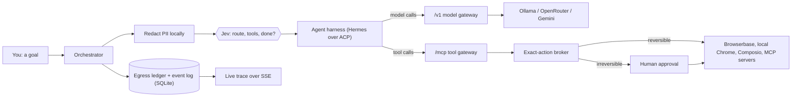

# Zephyr

**A control plane for AI agents.** Built at Hack the North 2026. (The codebase and the
design spec call the architecture **AgentOS**; Zephyr is the product.)

Agents today are a black box holding your credentials: every step goes to the most
expensive model, the agent can see every tool you own, your data goes wherever it decides,
and you find out about the email after it was sent.

Zephyr sits between any agent harness and the world. A tiny, non-generative decision model
(**Jev**) picks the model route, the handful of tools, and the moment to stop. Deterministic
policy — not the agent, and not Jev — has the final say over what is private, what is
authorized, and what needs a human first.

|                        |                                                                                                                                    |
| ---------------------- | ---------------------------------------------------------------------------------------------------------------------------------- |
| **Cheaper and faster** | Each step is routed on privacy × difficulty to a local, cheap-cloud, or frontier model. Compare any run to a single-call baseline. |
| **Private**            | Sensitive spans become `[[PII_n]]` before any cloud call. An egress ledger records every destination and the class of data sent.   |
| **Supervised**         | Actions are classified by **reversibility**. Irreversible ones pause on the exact payload: approve, reject, or revise.             |
| **Observable**         | A live, replayable trace of every decision, model call, tool call and approval. Pause, resume, cancel.                             |

**Start here:** [demo script](docs/DEMO.md) · [keys for the demo laptop](docs/DEMO-KEYS.md) · [sponsor tracks](docs/SPONSORS.md) ·
[Devpost copy](docs/DEVPOST.md) · [design spec](docs/agentos-design.md)

## Quick start

```bash
pnpm install && pnpm dev
```

Open http://localhost:5173. Type a goal, or go to **Runs** and launch the **Demo run**.

There is no `.env` step. With no API keys at all, every provider falls back to a mock and
the full demo runs end to end — deliberately, not as a placeholder. To go live, copy
`.env.example` to `.env` and fill in only the keys you have; see
[provider setup](docs/provider-setup.md). Requires Node ≥ 22 and pnpm 10.

| Command                 | What it does                                                      |
| ----------------------- | ----------------------------------------------------------------- |
| `pnpm dev`              | api on :8787 and web on :5173                                     |
| `pnpm typecheck`        | all three packages                                                |
| `pnpm test`             | the 11 `check:*` invariant suites + web unit tests (what CI runs) |
| `pnpm build`            | production build of the web app                                   |
| `pnpm smoke`            | end-to-end test against a running api                             |
| `pnpm smoke:live`       | same, against live providers (costs real money)                   |
| `pnpm check:providers`  | live Ollama + provider wiring check                               |
| `pnpm test:jev`         | one live Jev decision through the Vercel AI Gateway               |
| `pnpm test:jev:routing` | Jev's privacy × intelligence routing on sample tasks              |
| `pnpm format`           | prettier (respects `.prettierignore`)                             |

## How a run works



1. `POST /api/runs {kind, input}` returns immediately; execution streams over
   `GET /api/runs/:id/stream` (SSE with `Last-Event-ID` replay, persisted to SQLite).
2. Input is scanned locally; sensitive spans are pinned local and replaced with placeholders.
3. **Jev** narrows tool families → tools, and picks a route on two axes (`private`/`cloud` ×
   `low`/`high`). Below its confidence threshold or past its time budget, a deterministic
   rule decides instead. Every decision event records its `source`.
4. The harness runs behind Zephyr's own **model gateway** (`/v1`, OpenAI-compatible) and
   **MCP gateway** (`/mcp`), so it cannot reach a model or tool it was not handed.
5. The **broker** authorizes the _exact_ proposed action. Irreversible actions, and outbound
   text that GPTZero scores as likely AI-written, stop for a human. A revised payload is
   re-authorized and may only narrow the action.
6. Jev judges completion from canonical session state: `done`, `continue`, or `blocked`
   (which pauses the run for you rather than failing it).

Playbook kinds (`apps/api/src/core/playbooks/registry.ts`): **`agent`** — the main composer,
one supervised task from a plain goal · **`demo`** — scripted tour of every subsystem, works
with zero keys · **`graph`** — run a workflow authored on the canvas · **`baseline`** — a
single LLM call, the control for the Compare page.

## The app

| Route          | What it is                                                                                 |
| -------------- | ------------------------------------------------------------------------------------------ |
| `/`            | Composer. Starts a supervised `agent` run. A labelled preview mode uses synthetic data.    |
| `/runs`        | History, live status, launch a playbook directly                                           |
| `/runs/:id`    | Live trace: decisions, model calls, tool lifecycle, approvals, egress, pause/resume/cancel |
| `/compare`     | Run vs baseline: tokens, cost, latency                                                     |
| `/graphs`      | Workflow canvas                                                                            |
| `/connections` | Provider mode + health, Composio, generic MCP servers, reviewed tool inventory             |

## Providers

Playbooks ask for a **capability**, never a vendor; `providers/registry.ts` binds them.
Every provider has a mock twin. A missing key (or, for Hermes, a checkout path that does not
exist on this machine) **downgrades live → mock and never crashes**. The UI shows mode and
health as separate facts: `live` + unhealthy is not ready.

| Provider           | Role                                                                         | Goes live with                                                            |
| ------------------ | ---------------------------------------------------------------------------- | ------------------------------------------------------------------------- |
| Jev (TypeSafe AI)  | Every routing / tool / browser-target / completion decision                  | `AI_GATEWAY_API_KEY` (Vercel AI Gateway). [Read this first.](docs/jev.md) |
| Hermes (Nous)      | Agent harness, subprocess over ACP                                           | `uv` + a `hermes-agent` checkout at `HERMES_CWD`                          |
| Browserbase        | Cloud browser (Stagehand), swarm workers                                     | `BROWSERBASE_API_KEY`, `BROWSERBASE_PROJECT_ID`                           |
| Local Chrome       | The private browser route: local-only data never reaches the cloud           | Chrome installed, `LOCALBROWSER_MODE=live`                                |
| Composio           | 1000+ app tools with delegated OAuth; Gmail send is reviewed as irreversible | `COMPOSIO_API_KEY`, `COMPOSIO_AUTH_CONFIG_ID`                             |
| Generic MCP        | Any HTTP Streamable MCP server; unknown tools stay unavailable (fail-closed) | add it on `/connections`                                                  |
| OpenRouter, Gemini | Cloud model routes behind the model gateway                                  | `OPENROUTER_API_KEY`, `GEMINI_API_KEY`                                    |
| Ollama             | Local/private model route                                                    | Ollama running                                                            |
| Anthropic          | Bound `text.model` for redacted summarisation                                | `ANTHROPIC_API_KEY`                                                       |
| GPTZero            | Escalate-only check on outbound text written in your name                    | `GPTZERO_API_KEY`                                                         |

Flip one `<PROVIDER>_MODE=live` at a time and confirm it at `GET /api/providers`.

**Jev cannot generate text.** It returns a choice, a score, or a probability with calibrated
confidence. If you are writing a prompt for Jev you are using it wrong — it takes `criteria`.
And never skip `authorize_action` because "Jev is safe": being unable to invent an action
says nothing about whether the action it picked is authorized.

## Layout

```
packages/shared     types + zod schemas — imported by BOTH web and api
apps/api/src/
  api/              HTTP only. Knows req/res, knows no providers.
  core/             Pure domain + orchestration. No express, no fetch, no store import.
    playbooks/      what a run does
    tools/          reviewed registry, exact-action broker, approvals, browser tools
    decisions/      Jev-backed decisions with deterministic fallbacks
    modelGateway/   the /v1 surface the harness talks to
    mcp/            the /mcp surface the harness talks to + upstream MCP connections
  services/         Use-cases. Wires core + store + providers.
  providers/        The only place fetch/SDKs are allowed.
  store/            The only place data is held (memory or SQLite).
apps/web/src/       React + Vite SPA
hermes-tester/      disposable connectivity tester, not part of the product
docs/               spec, demo + sponsor + Devpost guides, contracts; docs/archive = history
```

**Dependency rule:** `api → services → core`, plus `services → providers` and
`services → store`. `core` imports nothing outward — it receives what it needs as arguments.
`packages/shared/src/domain.ts` is a published API: additive edits only. Vendor types must
not escape provider files.

### Adding a playbook

1. `packages/shared/src/schemas/playbooks/<kind>.ts` — the zod input schema
2. one line in `packages/shared/src/schemas/playbooks/index.ts`
3. `apps/api/src/core/playbooks/<kind>.playbook.ts`
4. one line in `apps/api/src/core/playbooks/registry.ts`

Nothing else changes: not the store, the routes, the streaming, or the UI chrome.

## Demo-day switches

| Env                     | Effect                                                                                            |
| ----------------------- | ------------------------------------------------------------------------------------------------- |
| `MOCK_ALL=true`         | Forces every provider to mock. **Rehearse with this on at least once — venue-wifi insurance.**    |
| `MOCK_FAILURE_RATE=0.2` | Mocks fail randomly, so error states are exercised                                                |
| `PERSIST_TO_DISK=true`  | SQLite persistence in `.data/`, so history survives API restarts and finished runs replay offline |
| `SQLITE_PATH=...`       | SQLite path resolved from `apps/api` (default `../../.data/agentos.sqlite`)                       |

## Things that will bite you

- **Never add `compression()` to the Express app.** gzip buffering silently breaks SSE and
  the symptom looks like a hung backend.
- **Express 5 rejects bare `*` routes** (path-to-regexp v8). Use `/*splat`.
- **A step's `output` is streamed and stored.** Never return a raw document from a step —
  return metadata and keep the document in a local variable. `pnpm smoke` asserts this.
- **`req.query` is getter-only in Express 5.** Validated data lands on `req.valid`.
- **`HERMES_CWD` is an absolute path.** A `.env` copied from a teammate points at their disk;
  the API warns and runs Hermes as mock.
- **One live Hermes run at a time.** The model gateway correlates calls to the single active
  session and fails closed when that is ambiguous.
- **Do not restart the API with an approval pending.** Event history is durable; the approval
  waiter is in-process, so the orphaned run fails safely.

## Known limits

No application auth (local hackathon demo) · generic MCP supports HTTP Streamable, not
stdio · editing a node of a _running_ workflow is not implemented · the production web
build expects the API on the same origin under `/api` (no static hosting is wired up).
Deliberately skipped: Docker, TS project references, ESLint, a state-management library.

## Team

Juan Cavallin ([@JuanCavallin](https://github.com/JuanCavallin)) · Daniel Zhao
([@danielzhao07](https://github.com/danielzhao07)) · Sheharyar
([@Sheharyar45](https://github.com/Sheharyar45)) · Krish
([@KrishP147](https://github.com/KrishP147))
