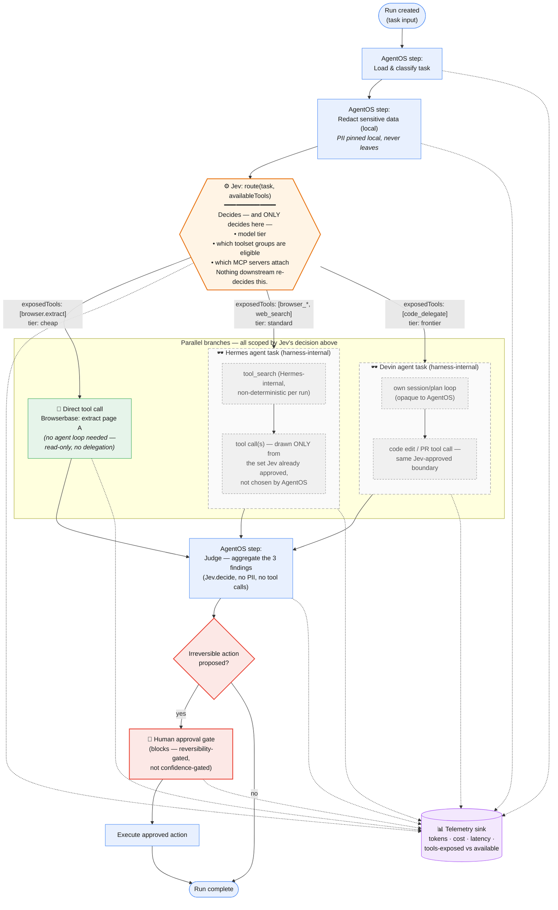

# Jev / AgentOS Architecture

```mermaid
flowchart TD
    Start(["Run created<br/>(task input)"]):::detStep
    Load["AgentOS step:<br/>Load & classify task"]:::detStep
    Redact["AgentOS step:<br/>Redact sensitive data (local)<br/><i>PII pinned local, never leaves</i>"]:::detStep

    Jev{{"⚙️ Jev: route(task, availableTools)<br/>━━━━━━━━━━━━━<br/>Decides — and ONLY decides here —<br/>• model tier<br/>• which toolset groups are eligible<br/>• which MCP servers attach<br/>Nothing downstream re-decides this."}}:::jevNode

    subgraph Fanout["Parallel branches — all scoped by Jev's decision above"]
        direction LR

        Tool1["🔧 Direct tool call<br/>Browserbase: extract page A<br/><i>(no agent loop needed —<br/>read-only, no delegation)</i>"]:::toolNode

        subgraph Hermes1["🕶️ Hermes agent task (harness-internal)"]
            direction TB
            H1a["tool_search (Hermes-internal,<br/>non-deterministic per run)"]:::opaqueNode
            H1b["tool call(s) — drawn ONLY from<br/>the set Jev already approved,<br/>not chosen by AgentOS"]:::opaqueNode
            H1a --> H1b
        end

        subgraph Devin1["🕶️ Devin agent task (harness-internal)"]
            direction TB
            D1a["own session/plan loop<br/>(opaque to AgentOS)"]:::opaqueNode
            D1b["code edit / PR tool call —<br/>same Jev-approved boundary"]:::opaqueNode
            D1a --> D1b
        end
    end

    Judge["AgentOS step:<br/>Judge — aggregate the 3 findings<br/>(Jev.decide, no PII, no tool calls)"]:::detStep

    RiskCheck{"Irreversible action<br/>proposed?"}:::gateNode
    Approval["🛑 Human approval gate<br/>(blocks — reversibility-gated,<br/>not confidence-gated)"]:::gateNode
    Execute["Execute approved action"]:::detStep
    Finish(["Run complete"]):::detStep

    Telemetry[("📊 Telemetry sink<br/>tokens · cost · latency ·<br/>tools-exposed vs available")]:::sinkNode

    Start --> Load --> Redact --> Jev

    Jev -->|"exposedTools: [browser.extract]<br/>tier: cheap"| Tool1
    Jev -->|"exposedTools: [browser_*, web_search]<br/>tier: standard"| Hermes1
    Jev -->|"exposedTools: [code_delegate]<br/>tier: frontier"| Devin1

    Tool1 --> Judge
    Hermes1 --> Judge
    Devin1 --> Judge

    Judge --> RiskCheck
    RiskCheck -->|yes| Approval --> Execute --> Finish
    RiskCheck -->|no| Finish

    Load -.-> Telemetry
    Redact -.-> Telemetry
    Jev -.-> Telemetry
    Tool1 -.-> Telemetry
    Hermes1 -.-> Telemetry
    Devin1 -.-> Telemetry
    Judge -.-> Telemetry
    Approval -.-> Telemetry

    classDef detStep fill:#e8f0fe,stroke:#4285f4,color:#1a1a1a
    classDef jevNode fill:#fff4e5,stroke:#e8710a,stroke-width:2px,color:#1a1a1a
    classDef opaqueNode fill:#f0f0f0,stroke:#999,stroke-dasharray:4 3,color:#555
    classDef toolNode fill:#e6f4ea,stroke:#34a853,color:#1a1a1a
    classDef gateNode fill:#fce8e6,stroke:#ea4335,stroke-width:2px,color:#1a1a1a
    classDef sinkNode fill:#f3e8fd,stroke:#a142f4,color:#1a1a1a

    style Hermes1 stroke-dasharray:6 4,stroke:#888,fill:#fafafa
    style Devin1 stroke-dasharray:6 4,stroke:#888,fill:#fafafa
```