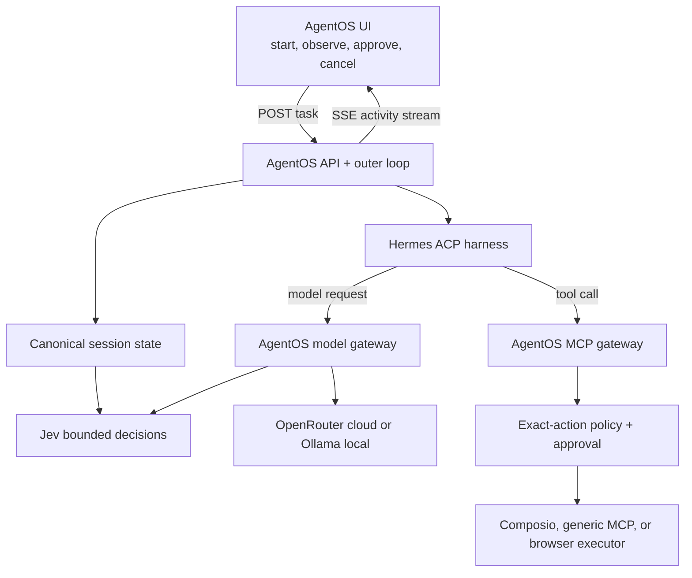

# Frontend Handoff — AgentOS Dashboard

This is the implementation handoff for the person building the AgentOS demo UI. It
describes the backend that exists now, the contracts the UI should consume, and the
remaining frontend work. The source-of-truth product design remains
[agentos-design.md](./agentos-design.md).

## What the product is

AgentOS is a harness-agnostic control plane. For this demo, the user starts a task in
our UI and AgentOS starts Hermes over ACP. Hermes keeps its reasoning loop, but its
model and tool boundaries pass through AgentOS:



Jev recommends:

- which eligible model route to use;
- which eligible tool families and tools to expose;
- semantic action risk;
- whether the task is `done`, should `continue`, or is `blocked`.

AgentOS—not Jev, Hermes, or the UI—remains the final authority for privacy,
authorization, approvals, deterministic completion checks, and execution.

## Current backend status

Snapshot: branch `shah` at commit `aa09037`.

Working now:

- UI-startable generic `agent` runs;
- canonical persisted session state and bounded Hermes continuation;
- Hermes ACP integration without modifying Hermes core;
- Jev model, tool, risk, and completion decisions with deterministic fallbacks;
- per-model-call routing through the AgentOS OpenAI-compatible gateway;
- OpenRouter cloud routes and Ollama local/private routes;
- reviewed tool registry and exact-action broker;
- AgentOS-owned MCP surface for Hermes;
- Composio discovery, Gmail OAuth state, and live email execution;
- generic upstream HTTP Streamable MCP connections;
- Browserbase and local Chrome tools behind the same broker;
- approval pause/resume for irreversible actions;
- SQLite persistence and replayable event history;
- lifecycle events for the full model, tool, harness, approval, and completion flow.

The current React UI predates several of these backend additions. It can list and open
runs, but it does **not** yet render all control, model, tool, harness, and session
events. Treat the contracts below and `@htn/shared` as authoritative, not the current
screen behavior.

## Frontend's responsibility

The dashboard should do five things:

1. Start a supervised task from a plain-language prompt.
2. Reconstruct and display the run from the event stream.
3. Show what AgentOS/Jev selected and what actually executed.
4. Let the user approve/reject exact proposed actions and cancel a run.
5. Let the user inspect providers and connect tool sources.

The frontend must not:

- call Hermes, Jev, OpenRouter, Ollama, Composio, Browserbase, or an upstream MCP server
  directly;
- select a model/tool or decide risk/completion itself;
- put API keys, OAuth tokens, or MCP header values in browser state or local storage;
- describe a proposal as executed until a success lifecycle event arrives;
- present mock, unavailable, or replayed activity as live execution.

## Local development

From the repository root:

```bash
pnpm install
pnpm dev
```

- UI: `http://localhost:5173`
- API: `http://localhost:8787`
- health: `GET /api/health`

Vite proxies `/api` to the API, so use relative browser URLs such as `/api/runs`.
Do not add websocket mode or response compression; the activity channel is SSE.

The ignored root `.env` selects live/mock providers. Do not copy secrets into this
document or frontend code. With no keys, provider adapters downgrade to mock rather than
preventing local UI work.

## Starting the real agent flow

The dashboard's primary composer should create the generic `agent` playbook:

```http
POST /api/runs
Content-Type: application/json

{
  "kind": "agent",
  "title": "Optional short display title",
  "input": {
    "goal": "Send an email to person@example.com saying: Let's lock in",
    "dataLabels": ["public"],
    "maxTurns": 3
  }
}
```

`goal` is required. `context`, `sanitizedGoal`, `dataLabels`, and `maxTurns` are
optional; `maxTurns` is limited to 1–5 and defaults to 3. If labels are omitted, the
backend uses redaction results to choose `public` or `private`. Only expose manual
labels/sanitization as an advanced control; do not ask a normal user to understand
internal routing fields.

The response is immediate:

```json
{ "run": { "id": "run_...", "status": "pending" } }
```

Navigate directly to the run screen and open its SSE stream. Execution continues in
the background.

## HTTP API the UI needs

All routes below are under `/api` unless shown otherwise.

| Purpose               | Method and path                  | Notes                                                                     |
| --------------------- | -------------------------------- | ------------------------------------------------------------------------- |
| Health                | `GET /health`                    | `{ ok, uptimeSeconds }`                                                   |
| Provider badges       | `GET /providers`                 | provider `mode`, health, capabilities, and capability bindings            |
| Launch choices        | `GET /playbooks`                 | use the `agent` kind for the main composer                                |
| Create run            | `POST /runs`                     | returns before execution finishes                                         |
| Run history           | `GET /runs?status=&kind=&limit=` | `limit` defaults to 50, maximum 200                                       |
| Run snapshot          | `GET /runs/:id`                  | run, steps, approvals, egress, PII metadata, schedule decisions, sessions |
| Full/catch-up history | `GET /runs/:id/events?since=0`   | persisted `StoredEvent[]` plus `lastSeq`                                  |
| Live run stream       | `GET /runs/:id/stream`           | replay + live SSE; preferred detail-page source                           |
| Dashboard stream      | `GET /stream`                    | live global events; refresh the run list on `run.updated`                 |
| Cancel                | `POST /runs/:id/cancel`          | terminally cancels the run                                                |
| Decide approval       | `POST /approvals/:id/decide`     | body has `decision` (`approved` or `rejected`) and optional `note`        |
| One approval          | `GET /approvals/:id`             | useful for a direct approval link                                         |
| Egress ledger         | `GET /runs/:id/egress`           | outbound destinations and data classes, never secret values               |
| Analytics             | `GET /runs/:id/analytics`        | cost/token/time rollup                                                    |
| Reviewed tool catalog | `GET /tools`                     | registered tools and availability                                         |
| Task tool discovery   | `POST /tools/discover`           | body: `{ query, toolkits?, limit? }`                                      |

Error bodies are consistently shaped as:

```json
{ "error": { "code": "...", "message": "...", "details": {} } }
```

## Event stream contract

`GET /api/runs/:id/stream` is the primary UI contract. It first replays persisted
history and then stays live. Every SSE frame has a monotonic per-run `id`; in the
browser it is available as `MessageEvent.lastEventId`. The `data` value is one
`RunEvent` JSON object.

Native `EventSource` automatically reconnects with `Last-Event-ID`, and the server
replays any gap. A fresh page can connect with cursor 0 and rebuild the run entirely
from the stream. For a manual client or export, use
`GET /api/runs/:id/events?since=<lastSeq>` and deduplicate by `seq`.

| Event                | What it means                              | Primary UI treatment                                         |
| -------------------- | ------------------------------------------ | ------------------------------------------------------------ |
| `run.updated`        | run status/result/error changed            | page header, terminal state, final result                    |
| `step.upserted`      | an outer-loop step changed                 | step timeline                                                |
| `schedule.decided`   | coarse Jev route/tool reduction            | candidate vs exposed tools, tier, confidence                 |
| `control.decided`    | bounded Jev/deterministic decision         | decision card with operation, selected IDs, source, reasons  |
| `model.lifecycle`    | model request/completion/failure           | actual provider/model, tools, tokens, cost, latency          |
| `harness.turn`       | Hermes inner-loop phase                    | Hermes turn timeline                                         |
| `tool.lifecycle`     | exact tool action through policy/execution | tool card and approval/execution phases                      |
| `approval.requested` | user input is required                     | blocking approval panel                                      |
| `approval.resolved`  | approval was approved/rejected             | lock the panel and record the decision                       |
| `session.updated`    | canonical AgentOS session changed          | turn, status, context version, budget, completion checkpoint |
| `egress.logged`      | an outbound provider call happened         | privacy/egress ledger                                        |
| `pii.detected`       | sensitive data was classified/redacted     | privacy indicator; never a raw value                         |
| `log`                | human-readable diagnostic                  | collapsible log row                                          |

Important lifecycle values:

- tool: `proposed`, `policy_decided`, `awaiting_approval`, `approved`, `executing`,
  `succeeded`, `blocked`, `failed`;
- model: `requested`, `completed`, `failed`;
- Hermes turn: `started`, `model_requested`, `tool_proposed`, `quiescent`,
  `cancelled`, `failed`;
- session: `created`, `running`, `quiescent`, `awaiting_approval`, `completed`,
  `blocked`, `failed`, `cancelled`.

Use stable IDs to upsert stateful records and preserve event arrival order for the
activity feed. The stream intentionally stays open after completion, so the client
should close it when the run becomes `succeeded`, `failed`, or `cancelled`.

### Existing stream-hook gap

`apps/web/src/hooks/useRunStream.ts` currently handles only run, step, approval, egress,
PII, schedule, and log events. The frontend implementation must add handling for:

- `control.decided`;
- `model.lifecycle`;
- `harness.turn`;
- `tool.lifecycle`;
- `session.updated`.

`RunView` already has control/model/harness/session collections, but needs an additive
tool-lifecycle collection (or a separate raw activity collection). Do not remove the
default reducer case: older tabs must safely ignore future event types.

## How to explain the live process

The trace should visually separate these related but different facts:

1. **Candidates**: routes/tools AgentOS found and deemed policy-eligible.
2. **Jev selection**: `control.decided`, including confidence, reason codes, and whether
   the source was `jev`, `deterministic`, or `fallback`.
3. **Actual model call**: `model.lifecycle`, including configured/actual model,
   provider, selected tools, tokens, cost, and latency.
4. **Exact tool proposal**: `tool.lifecycle.action`, including operation, arguments,
   destination, and data labels.
5. **Final authorization**: deterministic final policy and reason codes. Jev's risk
   recommendation is advisory.
6. **Execution outcome**: only `succeeded` proves the tool ran.
7. **Completion**: Jev judges canonical session state, then AgentOS verification decides
   whether `done` may end the loop.

For model identity, do not assume Qwen or an OpenAI model from the task text. Show
`model.lifecycle.providerId` and `actualModelId` when present; fall back to
`configuredModelId`. `schedule.decided.modelTier` is the earlier coarse tier, not proof
of which model ultimately served the call.

## Approval UX

When `approval.requested` arrives, the run becomes `awaiting_approval` and execution is
paused before the external side effect. Render all of these fields:

- `question`;
- `proposedAction` verbatim;
- `reversibility`;
- `riskClass`;
- `policyRule`.

Approve:

```http
POST /api/approvals/apr_.../decide
Content-Type: application/json

{ "decision": "approved" }
```

Reject:

```json
{ "decision": "rejected", "note": "Wrong recipient" }
```

Disable both buttons after submission and wait for `approval.resolved`; do not
optimistically mark the tool as executed. A decision is one-shot and a second decision
returns a conflict. If the API restarted while approval was pending, the orphaned run
fails safely because the in-memory waiter no longer exists.

Payload revision is not a separate backend endpoint yet. For the demo, support approve,
reject, and cancel truthfully; do not label reject-and-relaunch as in-place revision.

## Tool connections UI

### Composio

Composio is the managed-app path (Gmail for the current live demo):

| Purpose                       | Method and path                                                              |
| ----------------------------- | ---------------------------------------------------------------------------- |
| Start OAuth                   | `POST /api/providers/composio/connect` with `{ "authConfigId": "optional" }` |
| Refresh catalog/account state | `POST /api/providers/composio/refresh`                                       |
| Inspect configured tools      | `GET /api/providers/composio/tools`                                          |

Open the returned OAuth `url` in a new tab, let the user finish connection, then call
refresh and reload the catalog. The API owns the Composio user/account identity and
secrets. The UI should show connected/not-connected and tool availability only.

### Generic MCP servers

The backend supports user-added **HTTP Streamable** MCP servers:

| Purpose          | Method and path                                                |
| ---------------- | -------------------------------------------------------------- |
| List             | `GET /api/mcp-connections`                                     |
| Add and discover | `POST /api/mcp-connections`                                    |
| Refresh tools    | `POST /api/mcp-connections/:id/refresh`                        |
| Enable/disable   | `PATCH /api/mcp-connections/:id` with `{ "enabled": boolean }` |
| Remove           | `DELETE /api/mcp-connections/:id`                              |

Create body:

```json
{
  "name": "Company tools",
  "url": "https://mcp.example.com/mcp",
  "headerEnv": { "Authorization": "COMPANY_MCP_AUTH_HEADER" }
}
```

`headerEnv` values are server environment-variable **names**, never the secret values.
The actual values must be configured outside the browser in the ignored server `.env`.
Display `status`, `toolIds`, `executableToolIds`, `lastError`, and `lastRefreshedAt`.
Unknown tool-name classifications appear but stay unavailable; this is intentional
fail-closed behavior. The backend also rejects adding AgentOS's own downstream `/mcp`
endpoint as an upstream connection.

The statuses are `connected`, `error`, and `disabled`. Adding or refreshing may take up
to about 20 seconds because the server performs discovery before responding.

## Recommended screens

### 1. Task composer

- one prominent goal field;
- Start button creating an `agent` run;
- optional advanced `dataLabels` and `maxTurns`;
- provider readiness summary without exposing secrets.

### 2. Live run detail

- run status and cancel action;
- chronological activity feed;
- separate cards for Jev decisions, model calls, Hermes turns, tool calls, and approvals;
- canonical session summary and completion checkpoint;
- final result/error;
- egress/privacy ledger;
- token, latency, and cost metrics.

### 3. Connections

- Composio connect/refresh state;
- generic MCP add/list/enable/disable/refresh/remove;
- reviewed tool inventory with `available`, `requires_connection`, or `unavailable`;
- truthful provider mode/health badges from `/api/providers`.

### 4. Run history

- initial `GET /api/runs`;
- global `/api/stream` to refresh on `run.updated`;
- filtering by status/kind;
- a visible replay label when viewing a completed stored run.

## Suggested implementation order

1. Update the typed API client and stream reducer for all current contracts.
2. Replace the main launch experience with the generic task composer.
3. Build the raw chronological activity feed before polishing specialized cards.
4. Add the exact approval panel and cancel behavior.
5. Add provider/model/tool/session detail cards.
6. Add the Composio and generic MCP connections screen.
7. Add analytics, egress details, responsive polish, and empty/error/reconnect states.
8. Rehearse one live email task and one browser task from the UI only.

This order produces a usable end-to-end UI early; connection management does not block
the core demo because the backend machine is already configured.

## Known constraints to represent honestly

- The current model gateway correlates requests to the only active Hermes session.
  Concurrent live agent runs fail closed when correlation is ambiguous. Keep the demo to
  one active Hermes run at a time.
- Application authentication/RBAC is not implemented; this is a local hackathon demo.
- Generic upstream MCP currently supports HTTP Streamable transport, not local stdio.
- Local Chrome is the configured private browser route. Browserbase requires its own
  project credentials and may remain unavailable.
- Provider mode and health can differ. Show both; `live` plus unhealthy is not ready.
- SQLite uses Node's experimental built-in SQLite API, so a startup warning is expected.
- Full prompts/tool payloads are deliberately not copied into canonical session context.
  The UI receives compact summaries plus exact proposed action data at the approval
  boundary.
- Event history is durable with `PERSIST_TO_DISK=true`. An approval waiter itself is
  process-local, so do not restart the API while an approval is pending.

## Frontend acceptance checklist

- [ ] Typing a prompt and clicking Start launches `kind: "agent"` and navigates to it.
- [ ] Refreshing an active or completed run reconstructs the same trace without gaps.
- [ ] The trace distinguishes candidate, selected, proposed, authorized, and executed.
- [ ] The actual model/provider is sourced from `model.lifecycle`, not guessed.
- [ ] Jev source, confidence, and reason codes are visible.
- [ ] Exact tool arguments and deterministic authorization are visible.
- [ ] An irreversible action pauses and can be approved or rejected in the UI.
- [ ] No success is shown before `tool.lifecycle.phase === "succeeded"`.
- [ ] Verified completion and canonical session status are visible.
- [ ] Provider health/mode and tool availability are truthful.
- [ ] Composio and generic MCP connection states can be managed without exposing keys.
- [ ] Secrets and raw PII never appear in logs, local storage, or analytics.
- [ ] Failed, blocked, disconnected, reconnecting, empty, and cancelled states are clear.
- [ ] One email task and one browser task complete from the UI without using curl.

## Source files to trust

- `packages/shared/src/events.ts` — event union and current run-view types
- `packages/shared/src/control.ts` — Jev, model, tool, session, and completion contracts
- `packages/shared/src/domain.ts` — runs, steps, approvals, egress, and PII shapes
- `packages/shared/src/mcp.ts` — generic MCP connection contract
- `apps/api/src/api/*.routes.ts` — actual HTTP endpoints
- `apps/web/src/hooks/useRunStream.ts` — current reducer, including the gaps listed above
- `docs/provider-setup.md` — server-side provider configuration
- `docs/tool-registry-handoff.md` — registry/broker behavior and extension rules
- `docs/implementation_plan.md` — architecture decisions and team ownership

If a UI assumption conflicts with these shared types or actual routes, fix the UI
assumption. If a genuinely new backend capability is required, agree on an additive
shared contract before implementing it in both places.
